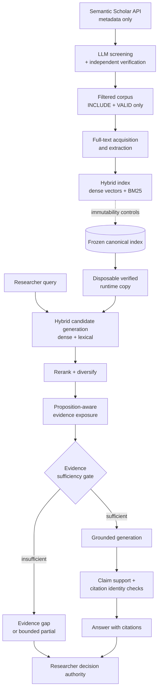

# HyBreDe — Governance-Aware Healthcare Evidence Retrieval & Synthesis

A research-oriented hybrid retrieval and evidence-synthesis prototype for healthcare
literature. HyBreDe combines dense semantic retrieval with lexical (BM25) retrieval,
then applies evidence-sufficiency checks, claim-level support verification and
citation/source identity verification before any answer is rendered. Where the
retrieved evidence does not support a claim, the system is designed to abstain or
return a bounded partial answer rather than produce an unsupported one. Final
evaluative authority stays with the human researcher.

This repository is a **public code release and research-engineering portfolio version
of HyBreDe**. It contains the **complete application code** — the Streamlit interface,
hybrid retrieval, reranking, diversification, evidence gating, claim verification,
screening, acquisition and indexing — sanitized for publication.

What it does **not** contain is the scientific corpus: no publisher PDFs, no extracted
full text, no frozen evidence store. Those are copyrighted or private, so **the exact
publication-facing results cannot be reproduced from this repository alone**. The
architecture is fully inspectable and adaptable; the published numbers are not
re-derivable without the private frozen corpus and index.

HyBreDe originated as **collaborative university capstone work** and is published here
as a multi-author project. See [CONTRIBUTIONS.md](CONTRIBUTIONS.md) for per-module
authorship and [SANITIZATION.md](SANITIZATION.md) for every change made for release.

---

## 2. What HyBreDe does

The pipeline runs in two phases.

**Offline corpus construction**
1. Bibliographic **metadata acquisition** from the Semantic Scholar Graph API.
2. **LLM-assisted title/abstract screening** against prespecified inclusion and
   exclusion criteria, with an independent second-pass verification call and full
   audit logging.
3. **Full-text acquisition and extraction** for the screened set.
4. **Indexing** into a hybrid store — dense vectors plus a BM25 lexical index —
   under immutability controls.

**Online retrieval and synthesis**
5. **Hybrid candidate generation** (dense + lexical), reranking and diversification.
6. **Proposition-aware evidence exposure** — the generator is shown only the
   specific supporting excerpts.
7. **Evidence-sufficiency gate** — if support is insufficient, the system returns an
   explicit evidence gap or a bounded partial answer.
8. **Claim-level and citation verification** — each rendered claim is checked for
   excerpt identity, citation validity and entailment.

---

## 3. Authorship

HyBreDe was built by a seven-person university capstone team, and this release
publishes **the whole system, not just my part of it**. I did not write all of it and
do not claim to have.

Line-level `git blame` attribution for every module is in
[CONTRIBUTIONS.md](CONTRIBUTIONS.md). In summary:

| Principally authored by collaborators | Principally authored by me |
|---|---|
| `Retrieval/retrieval.py` — hybrid retrieval core | `llm/rag_generator.py` — RAG orchestration, evidence gate, claim verification |
| `llm/interface.py` — provider abstraction | `app.py` — Streamlit interface |
| `data_acquisition/PDFscraper.py`, `pdf_to_text.py` | `screening/llm_screening.py` |
| `run_manifest.py`, `console_utils.py`, `project_paths.py` | `data_acquisition/scraper.py`, `immutable_index.py` |

**My independent post-capstone contribution** is the substantive research-engineering
layer, and it is entirely my own work:

- **governance** — freeze discipline, immutable scientific states, protection manifests
- **evaluation** — prespecified challenge-set design, run protocols, claim-level audits
- **validation** — evidence-sufficiency gating, claim-support and citation-identity
  verification, entailment guardrails
- **provenance** — immutability proofs, run manifests, failure localization and
  remediation protocols
- **publication preparation** — decision logs, validation documentation, the manuscript,
  and this sanitized public release

That layer is documented in [`docs/`](docs/) and [`evaluation/`](evaluation/), and is
implemented in `llm/rag_generator.py`, `immutable_index.py`, `validation/` and `tests/`.

---

## 4. Origin and scope

HyBreDe began as a multi-person **ICT capstone project at Turku University of Applied
Sciences** (7 contributors, 112 commits, February–September 2026). After the capstone
concluded, I continued the project independently on evaluation, validation, provenance
and publication preparation.

This release publishes the full application, collaborator-authored modules included.
The original project was already MIT-licensed and its copyright notice is preserved
verbatim in [LICENSE](LICENSE) alongside mine — nothing here is relicensed under a
single author's name. Collaborators are identified by role rather than by name, and no
collaborator email address appears anywhere in this repository.

**What remains out of scope** is data, not code: the research corpus, the frozen
evidence store, publisher PDFs, evaluation payloads containing corpus excerpts, and the
university capstone deliverable document. See [DATA_POLICY.md](DATA_POLICY.md).

---

## 5. Architecture



Key design commitments:

- **Dense + lexical hybrid retrieval.** Semantic similarity alone misses exact
  terminology; BM25 alone misses paraphrase. Candidates come from both.
- **Proposition-aware evidence exposure.** The generator sees specific supporting
  excerpts, not whole documents, which makes claim-to-source checking tractable.
- **Evidence-sufficiency gate.** Abstention is a first-class outcome. A conservative
  false abstention is preferred over an unsupported claim.
- **Citation and source identity verification.** Every rendered claim is checked
  against the excerpt it cites, so fabricated or mismatched citations are caught.
- **Immutable canonical index.** Evaluation never runs against the canonical store; it
  runs against a byte-verified disposable copy, and the source is re-hashed afterwards
  to prove it did not change. This is `immutable_index.py`.
- **Researcher decision authority.** The system pre-screens and drafts. It does not
  make clinical decisions.

---

## 6. Repository structure

```
hybrede-public-portfolio/
├── app.py                          Streamlit interface: query, disposition rendering,
│                                   claim → evidence exposure, scope handling
├── project_paths.py                Canonical path layout (HYBREDE_DATA_DIR /
│                                   HYBREDE_RAG_STORE_DIR configurable)
├── run_manifest.py                 Run manifest emission for provenance
├── console_utils.py                Deterministic console JSON dumping
├── immutable_index.py              Immutable-source / disposable-runtime controls:
│                                   tree hashing, verified copy, tamper proof
│
├── Retrieval/
│   └── retrieval.py                Hybrid retrieval core:
│                                     · chunking + section splitting
│                                     · dense semantic retrieval (Chroma, MiniLM)
│                                     · BM25 lexical index and scoring
│                                     · hybrid candidate generation and fusion
│                                     · cross-encoder reranking
│                                     · MMR diversification
│                                     · index build (`index` command)
│
├── llm/
│   ├── interface.py                LLM provider abstraction (OpenAI / Ollama)
│   ├── rag_generator.py            RAG orchestration:
│   │                                 · proposition-aware evidence exposure
│   │                                 · evidence-sufficiency gate
│   │                                 · grounded generation
│   │                                 · claim-support verification
│   │                                 · citation / source-identity verification
│   │                                 · batch + single-query evaluation entry points
│   └── _init_.py
│
├── screening/
│   └── llm_screening.py            LLM title/abstract screening, independent
│                                   second-pass verification, audit logging
│
├── data_acquisition/
│   ├── scraper.py                  Semantic Scholar Graph API metadata acquisition
│   ├── PDFscraper.py               PDF harvesting for the screened set
│   └── pdf_to_text.py              PDF → text extraction, fuzzy identity matching
│
├── validation/                     Corpus-integrity and evaluation harness scripts
│   ├── acquisition_corpus_audit/
│   │   ├── audit_acquisition_corpus.py
│   │   ├── corpus_correction_assessment/assess_corpus_correction.py
│   │   └── manual_identity_review/review_unresolved_fulltexts.py
│   └── prospective_evaluation_v6/
│       └── run_post_remediation_run14_regression.py
│
├── tests/                          13 modules; 89 tests pass with no corpus or key
│   └── README.md                   What passes, what does not, and why
│
├── examples/
│   ├── smoke_test.py               Startup verification; --build-index builds a real
│   │                               index from the synthetic corpus
│   ├── synthetic_corpus/           3 fabricated records in the indexer's schema
│   └── README.md
│
├── docs/                           architecture · methodology · reproducibility ·
│                                   limitations
├── evaluation/                     challenge-set design · publication-facing summary
│
├── requirements.txt                Dependency set
├── requirements-lock.txt           Frozen pip state of the evaluated environment
├── environment.yml                 Conda environment (source of truth for Conda users)
├── .env.example                    Every environment variable the code reads
│
├── README.md                       This file
├── CONTRIBUTIONS.md                Per-module line-level authorship
├── SANITIZATION.md                 Every change made for public release
├── DATA_POLICY.md                  What is excluded and how to build your own corpus
├── LICENSE                         MIT — capstone team + post-capstone copyright
└── LICENSE-docs                    CC BY 4.0 for release documentation
```

**Not present, by design:** `data/` (corpus, metadata, extracted full text),
`rag_store/` (Chroma store and lexical index), publisher PDFs, model binaries,
`.env`. See [DATA_POLICY.md](DATA_POLICY.md).

---

## 7. Running the system

Nothing below refers to any author's machine. Every path comes from configuration and
defaults to a location inside your own checkout.

### 1. Environment

```bash
git clone https://github.com/zoitheofilakou-ctrl/hybrede-public-portfolio.git
cd hybrede-public-portfolio

python -m venv .venv
source .venv/bin/activate          # Windows: .venv\Scripts\activate
pip install -r requirements.txt
```

Conda users should prefer `conda env create -f environment.yml`, which is the source of
truth for the evaluated environment. `requirements-lock.txt` records the exact frozen
pip state if you need to match it.

### 2. Credentials

```bash
cp .env.example .env
```

Fill in `OPENAI_API_KEY`, or configure `OLLAMA_BASE_URL` / `OLLAMA_MODEL` to run a local
model instead. `SEMANTIC_SCHOLAR_API_KEY` is needed only for metadata acquisition.
`.env` is git-ignored, and **no real credential exists anywhere in this repository**.

### 3. Models

Retrieval loads its two models with `local_files_only=True`, so they must already be in
your Hugging Face cache:

```bash
python -c "from sentence_transformers import SentenceTransformer, CrossEncoder; SentenceTransformer('all-MiniLM-L6-v2'); CrossEncoder('cross-encoder/ms-marco-MiniLM-L-6-v2')"
```

Set `HF_HOME` first if you want that cache somewhere specific. No cache path is
hardcoded in this repository.

### 4. Verify the install before touching any data

```bash
python examples/smoke_test.py
```

17 checks: every module imports, every path resolves from configuration, and a missing
evidence store is reported clearly. Add `--build-index` to build and query a real hybrid
index from the included synthetic corpus (19 checks).

### 5. Point the system at a corpus and an evidence store

**The original frozen research index is not distributed. Users must build or supply
their own compatible evidence store.**

```bash
export HYBREDE_DATA_DIR=/path/to/your/corpus        # default: ./data
export HYBREDE_RAG_STORE_DIR=/path/to/your/store    # default: ./rag_store
```

Expected corpus layout under `HYBREDE_DATA_DIR`:

```
hybrede_metadata_v5.json                    Semantic Scholar records
fulltext/<paperId>.txt                      extracted full text (optional)
processed/filtered_papers.json              screening output: INCLUDE + VALID
processed/corpus_source_manifest_v3.json    per-paper source declaration
```

`examples/synthetic_corpus/` is a working example of exactly that layout.

### 6. Build a corpus

```bash
python data_acquisition/scraper.py           # metadata (needs SEMANTIC_SCHOLAR_API_KEY)
python screening/llm_screening.py            # screening → filtered_papers.json
python data_acquisition/PDFscraper.py        # optional: harvest PDFs
python data_acquisition/pdf_to_text.py       # optional: PDF → text
```

Abstract-only corpora index fine; full text improves retrieval but is not required.
Whatever you harvest is copyrighted — keep it local and do not commit it.

### 7. Build the index

```bash
python Retrieval/retrieval.py index
```

### 8. Run the application

```bash
streamlit run app.py
```

If no evidence store is present the app still starts, and warns *"No vector index found.
Build the index before asking questions."* It never points at a path you do not have.

---

## 8. Evaluation

Full detail: [`evaluation/results/publication_facing_summary.md`](evaluation/results/publication_facing_summary.md).

The **publication-facing evaluation** is Run 14: a prespecified ten-case behavioural
challenge set (eight independent cases, two regression cases) frozen before execution.
It produced **7/10 expected dispositions with three false abstentions**.

A later **known-case regression** re-ran those same ten cases after remediation and
matched **9 of 10 expected dispositions**. Because it reused already-known cases, this
is explicitly **not accuracy** and not an estimate of general performance. Two of the
three false abstentions were corrected; one was retained deliberately.

Claim-level outcomes in the final regression:

| Metric | Result |
|---|---|
| Rendered substantive claims | 8 |
| Directly supported claims | 8 |
| Unsupported claims | 0 |
| Invalid or fabricated citations | 0 |
| Source/excerpt identity mismatches | 0 |
| Unsupported causal/comparative/numerical/temporal claims | 0 |
| Technical failures | 0 |

**Developmental runs 1–13 are not publication-facing results.** They are internal
iteration history and are not presented as validation outcomes.

---

## 9. Scientific integrity and governance

This is the part of the project I consider most transferable to engineering work:

- **Prespecified cases.** The challenge set and expected dispositions were frozen
  before execution, so results could not be defined after seeing outputs.
- **Immutable frozen states.** Scientific states are tagged and hash-verified; the
  canonical index tree hash was identical before and after evaluation.
- **Explicit evidence gaps.** "I cannot support this from the retrieved evidence" is a
  designed output, not a failure path.
- **Bounded partial answers.** One case returned only the supported definition, cited
  the approved excerpt, and explicitly refused to supply an unsupported numeric value.
- **Claim-level verification** with automated excerpt-identity, citation and entailment
  checks.
- **Documented limitation of the regression.** The 9/10 result is reported as a
  known-case regression, not as accuracy.

A previously stated `130/130` test claim was **withdrawn** during publication
preparation because no corresponding primary execution report could be recovered. It
was not replaced with another figure. Recording that openly, rather than quietly
restating it, was the correct call and is documented in the decision log.

---

## 10. Limitations

- Research prototype. Not a production system and not clinically validated.
- Small prespecified evaluation set (ten cases). No general-performance claim follows.
- No independent blinded human adjudication of rendered claims; verification was
  automated.
- The post-remediation run reused the same known cases, so it cannot demonstrate
  generalisation.
- No real clinical deployment, no patient data, no regulatory assessment.
- The research corpus and frozen index are **not included** for copyright reasons, so
  the published retrieval results cannot be reproduced from this repository alone.
- The interface reports the frozen evidence base (105 records, 715 segments). Those
  figures describe a corpus that is not distributed; they will not describe an index
  you build. See [SANITIZATION.md](SANITIZATION.md).

---

## 11. Reproducibility

This repository is intended to be **read, reviewed, run and adapted**.

**You can:**
- inspect and run the entire pipeline — acquisition, screening, extraction, indexing,
  hybrid retrieval, reranking, diversification, evidence gating, generation and claim
  verification — against a corpus you assemble yourself under your own API keys;
- verify startup with no data at all: `python examples/smoke_test.py`, and
  `--build-index` to build and query a real index from the included synthetic corpus;
- run the test suite: 89 tests pass with no corpus, no index and no API key
  (see [tests/README.md](tests/README.md));
- reuse `immutable_index.py` directly — it is self-contained and dependency-free;
- read the methodology, protocols and evaluation design in `docs/` and `evaluation/`.

**You cannot:** reproduce the original published results. That requires the frozen
corpus and index, which are not redistributable. The limitation is the data, not the
code. See [`docs/reproducibility.md`](docs/reproducibility.md) and
[`DATA_POLICY.md`](DATA_POLICY.md).

Recorded environment of the publication-facing evaluation: Python 3.11.5,
`all-MiniLM-L6-v2` embeddings, `cross-encoder/ms-marco-MiniLM-L-6-v2` reranker,
`gpt-4o-mini` generation, ChromaDB 1.5.1, Sentence Transformers 5.2.3, and a frozen
retrieval identity of 715 Chroma segments and 715 BM25 records.

---

## 12. Publication and presentation provenance

The authoritative scientific states are retained privately and are **not** rewritten,
rebased or republished for this portfolio:

| State | Commit |
|---|---|
| Publication freeze (`hybrede-publication-freeze-v1`) | `1a49d73fd000e1b956ba69bfe2d99f208fac2caa` |
| Presentation demo freeze (`hybrede-presentation-demo-freeze-v1`) | `ed3692054b327313d7a8092513c49672c7c70d98` |

Those SHAs are cited in the manuscript and conference materials. This public repository
has an unrelated, fresh git history by design: rewriting the frozen repositories to
sanitize them would have invalidated the very identities the scientific record depends
on. The frozen repositories remain byte-intact elsewhere.

Associated outputs: a manuscript prepared for FinJeHeW and a conference poster for
eHealth 2026.

---

## 13. Data policy

No scientific literature is included in this repository — no publisher PDFs, no
extracted full text, no corpus excerpts. This is deliberate: the original working
corpus consists of copyrighted journal articles that cannot be redistributed. See
[DATA_POLICY.md](DATA_POLICY.md) for how to assemble your own corpus.

---

## 14. Licence

- **Code**: [MIT](LICENSE), carrying **two** copyright notices — the original
  Turku UAS ICT Capstone Team notice, reproduced verbatim from the source repository,
  and mine for the post-capstone work. The original project was already MIT-licensed;
  the terms are unchanged and **no collaborator-authored code has been relicensed under
  a single author's name**.
- **Release documentation** (`README.md`, `docs/`, `evaluation/`, and the other Markdown
  files written for this release): [CC BY 4.0](LICENSE-docs).

These licences cover **only** the material in this repository. They do not apply to any
third-party literature, model or dataset. Per-module authorship is in
[CONTRIBUTIONS.md](CONTRIBUTIONS.md); any collaborator who wants their contribution
attributed differently or removed should say so and it will be acted on.
