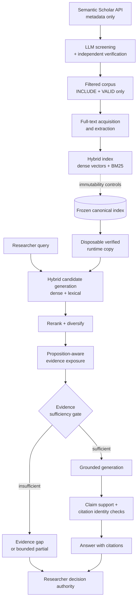

# HyBreDe — Governance-Aware Healthcare Evidence Retrieval & Synthesis

A research-oriented hybrid retrieval and evidence-synthesis prototype for healthcare
literature. HyBreDe combines dense semantic retrieval with lexical (BM25) retrieval,
then applies evidence-sufficiency checks, claim-level support verification and
citation/source identity verification before any answer is rendered. Where the
retrieved evidence does not support a claim, the system is designed to abstain or
return a bounded partial answer rather than produce an unsupported one. Final
evaluative authority stays with the human researcher.

This repository is a **sanitized public portfolio release**. It contains the
components I authored and am entitled to redistribute, plus the research,
evaluation and governance methodology I developed. It is not the full system and
is not a runnable end-to-end demo — see [Scope](#4-origin-and-scope) and
[Reproducibility](#9-reproducibility).

---

## 2. What HyBreDe does

The pipeline runs in two phases.

**Offline corpus construction**
1. Bibliographic **metadata acquisition** from the Semantic Scholar Graph API.
2. **LLM-assisted title/abstract screening** against prespecified inclusion and
   exclusion criteria, with an independent second-pass verification call and full
   audit logging.
3. **Full-text acquisition and extraction** for the screened set.
4. **Indexing** into a hybrid store — dense vectors plus a BM25 lexical index —
   under immutability controls.

**Online retrieval and synthesis**
5. **Hybrid candidate generation** (dense + lexical), reranking and diversification.
6. **Proposition-aware evidence exposure** — the generator is shown only the
   specific supporting excerpts.
7. **Evidence-sufficiency gate** — if support is insufficient, the system returns an
   explicit evidence gap or a bounded partial answer.
8. **Claim-level and citation verification** — each rendered claim is checked for
   excerpt identity, citation validity and entailment.

---

## 3. My contribution

The original system was built by a seven-person university capstone team. **I did not
write all of it**, and the parts I did not write are not included here.

**My principal or sole authorship in this repository**

| Component | Authorship |
|---|---|
| `src/acquisition/scraper.py` — metadata acquisition | ~90% of lines mine |
| `src/screening/llm_screening.py` — LLM screening + verification + audit logging | ~96% of lines mine |
| `src/indexing/immutable_index.py` — immutable-source / disposable-runtime controls | 100% mine |
| `src/common/paths.py` — configurable path layout | written fresh for this release |

Line-level attribution was measured with `git blame` against the original repository.
See [CONTRIBUTIONS.md](CONTRIBUTIONS.md) for the full breakdown, including which
modules are **excluded** because collaborators wrote them.

**My independent post-capstone research contribution** — this is the substantial part,
and it is entirely my own work:

- evaluation design and prespecified challenge-set methodology
- freeze discipline: immutable scientific states, freeze gates, protection manifests
- provenance tracking and immutability proofs across evaluation runs
- claim-level and citation-identity verification methodology
- failure analysis and remediation protocols
- publication-facing validation documentation and decision logs

That research layer is documented in [`docs/`](docs/) and [`evaluation/`](evaluation/).

---

## 4. Origin and scope

HyBreDe began as a multi-person **ICT capstone project at Turku University of Applied
Sciences** (7 contributors, 112 commits, February–September 2026). The retrieval and
generation core was principally authored by a teammate and is **deliberately not
redistributed here**; it is described in [`docs/architecture.md`](docs/architecture.md)
so the design is understandable without publishing someone else's code.

After the capstone concluded, I continued independently on evaluation, validation,
provenance and publication preparation. That later work is the focus of this portfolio.

---

## 5. Architecture

Key design commitments:

- **Dense + lexical hybrid retrieval.** Semantic similarity alone misses exact
  terminology; BM25 alone misses paraphrase. Candidates come from both.
- **Proposition-aware evidence exposure.** The generator sees specific supporting
  excerpts, not whole documents, which makes claim-to-source checking tractable.
- **Evidence-sufficiency gate.** Abstention is a first-class outcome. A conservative
  false abstention is preferred over an unsupported claim.
- **Citation and source identity verification.** Every rendered claim is checked
  against the excerpt it cites, so fabricated or mismatched citations are caught.
- **Immutable canonical index.** Evaluation never runs against the canonical store; it
  runs against a byte-verified disposable copy, and the source is re-hashed afterwards
  to prove it did not change. This is `src/indexing/immutable_index.py`.
- **Researcher decision authority.** The system pre-screens and drafts. It does not
  make clinical decisions.

---

## 6. Evaluation

Full detail: [`evaluation/results/publication_facing_summary.md`](evaluation/results/publication_facing_summary.md).

The **publication-facing evaluation** is Run 14: a prespecified ten-case behavioural
challenge set (eight independent cases, two regression cases) frozen before execution.
It produced **7/10 expected dispositions with three false abstentions**.

A later **known-case regression** re-ran those same ten cases after remediation and
matched **9 of 10 expected dispositions**. Because it reused already-known cases, this
is explicitly **not accuracy** and not an estimate of general performance. Two of the
three false abstentions were corrected; one was retained deliberately.

Claim-level outcomes in the final regression:

| Metric | Result |
|---|---|
| Rendered substantive claims | 8 |
| Directly supported claims | 8 |
| Unsupported claims | 0 |
| Invalid or fabricated citations | 0 |
| Source/excerpt identity mismatches | 0 |
| Unsupported causal/comparative/numerical/temporal claims | 0 |
| Technical failures | 0 |

**Developmental runs 1–13 are not publication-facing results.** They are internal
iteration history and are not presented as validation outcomes.

---

## 7. Scientific integrity and governance

This is the part of the project I consider most transferable to engineering work:

- **Prespecified cases.** The challenge set and expected dispositions were frozen
  before execution, so results could not be defined after seeing outputs.
- **Immutable frozen states.** Scientific states are tagged and hash-verified; the
  canonical index tree hash was identical before and after evaluation.
- **Explicit evidence gaps.** "I cannot support this from the retrieved evidence" is a
  designed output, not a failure path.
- **Bounded partial answers.** One case returned only the supported definition, cited
  the approved excerpt, and explicitly refused to supply an unsupported numeric value.
- **Claim-level verification** with automated excerpt-identity, citation and entailment
  checks.
- **Documented limitation of the regression.** The 9/10 result is reported as a
  known-case regression, not as accuracy.

A previously stated `130/130` test claim was **withdrawn** during publication
preparation because no corresponding primary execution report could be recovered. It
was not replaced with another figure. Recording that openly, rather than quietly
restating it, was the correct call and is documented in the decision log.

---

## 8. Limitations

- Research prototype. Not a production system and not clinically validated.
- Small prespecified evaluation set (ten cases). No general-performance claim follows.
- No independent blinded human adjudication of rendered claims; verification was
  automated.
- The post-remediation run reused the same known cases, so it cannot demonstrate
  generalisation.
- No real clinical deployment, no patient data, no regulatory assessment.
- The research corpus is **not included** for copyright reasons, so retrieval quality
  cannot be reproduced from this repository alone.
- Retrieval and generation modules are omitted here for authorship reasons.

---

## 9. Reproducibility

This repository is intended to be **read, reviewed and adapted** — not to reproduce the
original demo.

What you can do here:
- inspect the acquisition and screening stages and run them against your own corpus
  with your own API keys;
- reuse `immutable_index.py` directly — it is self-contained and dependency-free;
- read the methodology, protocols and evaluation design in `docs/` and `evaluation/`.

What you cannot do here: reproduce the original published results. That requires the
frozen corpus and index, which are not redistributable. See
[`docs/reproducibility.md`](docs/reproducibility.md) and [`DATA_POLICY.md`](DATA_POLICY.md).

Recorded environment of the publication-facing evaluation: Python 3.11.5,
`all-MiniLM-L6-v2` embeddings, `cross-encoder/ms-marco-MiniLM-L-6-v2` reranker,
`gpt-4o-mini` generation, ChromaDB 1.5.1, Sentence Transformers 5.2.3, and a frozen
retrieval identity of 715 Chroma segments and 715 BM25 records.

---

## 10. Publication and presentation provenance

The authoritative scientific states are retained privately and are **not** rewritten,
rebased or republished for this portfolio:

| State | Commit |
|---|---|
| Publication freeze (`hybrede-publication-freeze-v1`) | `1a49d73fd000e1b956ba69bfe2d99f208fac2caa` |
| Presentation demo freeze (`hybrede-presentation-demo-freeze-v1`) | `ed3692054b327313d7a8092513c49672c7c70d98` |

Those SHAs are cited in the manuscript and conference materials. This public repository
has an unrelated, fresh git history by design: rewriting the frozen repositories to
sanitize them would have invalidated the very identities the scientific record depends
on. The frozen repositories remain byte-intact elsewhere.

Associated outputs: a manuscript prepared for FinJeHeW and a conference poster for
eHealth 2026.

---

## 11. Data policy

No scientific literature is included in this repository — no publisher PDFs, no
extracted full text, no corpus excerpts. This is deliberate: the original working
corpus consists of copyrighted journal articles that cannot be redistributed. See
[DATA_POLICY.md](DATA_POLICY.md) for how to assemble your own corpus.

---

## 12. Licence

- **Code** (`src/`): [MIT](LICENSE).
- **Documentation** (`README.md`, `docs/`, `evaluation/`, and the other Markdown files):
  [CC BY 4.0](LICENSE-docs).

These licences cover **only** the material in this repository. They do not relicense
the original capstone repository, do not cover collaborator-authored modules, and do
not apply to any third-party literature. See [CONTRIBUTIONS.md](CONTRIBUTIONS.md).
